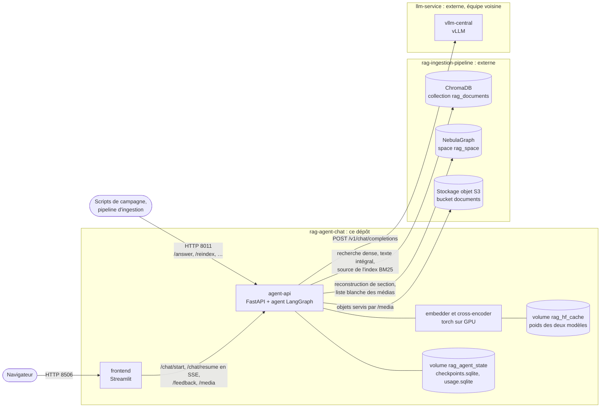
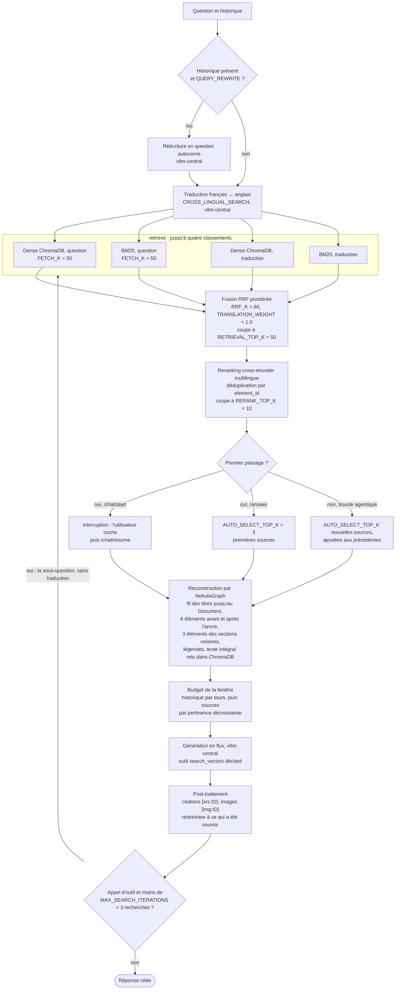
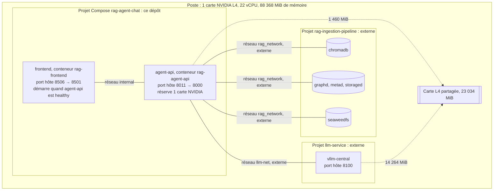

# RAG Agent Chat

Point d'entrée du dépôt : ce que fait l'agent, comment le reprendre, le lancer et le vérifier, sur quel matériel, et où lire la suite. Pour qui reprend le projet.

`rag-agent-chat` est un agent conversationnel de question-réponse documentaire. Il ne possède aucune donnée : il lit en lecture seule les stores que produit [rag-ingestion-pipeline](https://github.com/floSa/rag-ingestion-pipeline) (base vectorielle, graphe de structure, stockage objet) et génère ses réponses avec le serveur vLLM de [llm-service](https://github.com/floSa/llm-service). L'orchestration est une machine à états LangGraph ; l'utilisateur choisit lui-même les sources avant que la réponse ne soit écrite.


Version livrée : étiquette git `v1.1.0`. Chaque commande de ce document a été exécutée le 27 septembre 2026, ou porte la mention « non exécutée ici » avec sa raison.

## Reprendre le projet

1. **Lire l'état et la suite** : [etat_du_projet.md](documentation/etat_du_projet.md) (ce qui marche, avec ses mesures), puis [prochaines_etapes.md](documentation/prochaines_etapes.md) (les questions ouvertes, ordonnées par le coût de l'échec).
2. **Savoir où vivent les chiffres** : chaque mesure a un site canonique, une section du registre [axes_amelioration.md](documentation/axes_amelioration.md) ou une ligne du journal [pilotage_du_chantier.md](documentation/pilotage_du_chantier.md). Corriger le registre en ajoutant, daté, jamais en effaçant ; les rapports de [audits/](documentation/audits/README.md) ne se réécrivent pas.
3. **Monter l'environnement de mesure** par la [porte qualité](#porte-qualité), dans un arbre neuf, jamais dans le `.venv` d'un autre travail.
4. **Armer les garde-fous git** par `make install`, depuis le clone principal seulement : identité d'auteur autorisée, aucune attribution, porte avant la poussée.
5. **Configurer** : le `.env` vit dans le clone principal ([Lancer](#lancer)).
6. **Vérifier les stores avant toute mesure** : `make verifier-les-ancrages`, puis `POST /reindex` après chaque réingestion du pipeline.
7. **Déployer** par la marche du §4 de [identite_du_code_servi.md](documentation/identite_du_code_servi.md) : étiqueter l'image servie avant de construire, puis vérifier `code_servi` dans `/health`.

## Architecture

Vérifié contre `docker-compose.yml`, `src/api/main.py`, `src/frontend/app.py` et `src/agent/settings.py` :


```mermaid
flowchart LR
    NAV(["Navigateur"]) -->|"HTTP 8506"| FR
    CLI(["Scripts de campagne,<br/>pipeline d'ingestion"]) -->|"HTTP 8011<br/>/answer, /reindex, …"| API

    subgraph ICI["rag-agent-chat : ce dépôt"]
        FR["frontend<br/>Streamlit"]
        API["agent-api<br/>FastAPI + agent LangGraph"]
        TORCH["embedder et cross-encoder<br/>torch sur GPU"]
        ETAT[("volume rag_agent_state<br/>checkpoints.sqlite, usage.sqlite")]
        HF[("volume rag_hf_cache<br/>poids des deux modèles")]
        FR -->|"/chat/start, /chat/resume en SSE,<br/>/feedback, /media"| API
        API --- TORCH
        API --- ETAT
        TORCH --- HF
    end

    subgraph PIPE["rag-ingestion-pipeline : externe"]
        CH[("ChromaDB<br/>collection rag_documents")]
        NG[("NebulaGraph<br/>space rag_space")]
        S3[("Stockage objet S3<br/>bucket documents")]
    end

    subgraph LLMS["llm-service : externe, équipe voisine"]
        VL["vllm-central<br/>vLLM"]
    end

    API -->|"recherche dense, texte intégral,<br/>source de l'index BM25"| CH
    API -->|"reconstruction de section,<br/>liste blanche des médias"| NG
    API -->|"objets servis par /media"| S3
    API -->|"POST /v1/chat/completions"| VL
```

L'agent n'écrit que dans son volume `rag_agent_state`. L'index BM25 vit en mémoire dans le processus de l'API. Vue système et décisions : [architecture.md](documentation/architecture.md) ; détail de l'agent : [agent_architecture.md](documentation/agent_architecture.md).

## Le chemin d'une question

Vérifié contre `src/agent/graph.py` (nœuds et arêtes), `src/agent/retriever.py`, `src/agent/lexical.py`, `src/agent/graph_context.py` et `src/agent/llm.py` ; les valeurs sont les défauts de `settings.py`.


```mermaid
flowchart TD
    Q["Question et historique"] --> RW{"Historique présent<br/>et QUERY_REWRITE ?"}
    RW -->|oui| REW["Réécriture en question autonome<br/>vllm-central"]
    RW -->|non| TR
    REW --> TR["Traduction français ↔ anglais<br/>CROSS_LINGUAL_SEARCH, vllm-central"]

    subgraph RET["retrieve : jusqu'à quatre classements"]
        D1["Dense ChromaDB, question<br/>FETCH_K = 50"]
        B1["BM25, question<br/>FETCH_K = 50"]
        D2["Dense ChromaDB, traduction"]
        B2["BM25, traduction"]
    end

    TR --> D1 & B1 & D2 & B2
    D1 & B1 & D2 & B2 --> FU["Fusion RRF pondérée<br/>RRF_K = 60, TRANSLATION_WEIGHT = 1.0<br/>coupe à RETRIEVAL_TOP_K = 50"]
    FU --> RR["Reranking cross-encoder multilingue<br/>déduplication par element_id<br/>coupe à RERANK_TOP_K = 10"]
    RR --> SEL{"Premier passage ?"}
    SEL -->|"oui, /chat/start"| HUM["Interruption : l'utilisateur coche<br/>puis /chat/resume"]
    SEL -->|"oui, /answer"| AUTO["AUTO_SELECT_TOP_K = 3<br/>premières sources"]
    SEL -->|"non, boucle agentique"| AUTO2["AUTO_SELECT_TOP_K nouvelles sources,<br/>ajoutées aux précédentes"]
    HUM & AUTO & AUTO2 --> RC["Reconstruction par NebulaGraph<br/>fil des titres jusqu'au Document,<br/>6 éléments avant et après l'ancre,<br/>3 éléments des sections voisines,<br/>légendes, texte intégral relu dans ChromaDB"]
    RC --> FIT["Budget de la fenêtre<br/>historique par tours, puis sources<br/>par pertinence décroissante"]
    FIT --> GEN["Génération en flux, vllm-central<br/>outil search_vectors déclaré"]
    GEN --> PP["Post-traitement<br/>citations [src:ID], images [img:ID]<br/>restreintes à ce qui a été soumis"]
    PP --> LOOP{"Appel d'outil et moins de<br/>MAX_SEARCH_ITERATIONS = 3 recherches ?"}
    LOOP -->|"oui : la sous-question, sans traduction"| RET
    LOOP -->|non| FIN(["Réponse citée"])
```

Deux précisions que le schéma ne dit pas :

- `/chat/simple` contourne ce chemin : il génère à partir de sources déjà choisies, sans recherche ni boucle.
- La décomposition de la question en sous-questions n'existe pas dans le service. Elle est mesurée par des bancs (`scripts/`), pas implémentée ([etat_du_projet.md](documentation/etat_du_projet.md), §2.1).

## Le déploiement

Vérifié contre `docker-compose.yml` et relevé en lecture seule le 27 septembre 2026 (`docker inspect`, étiquette `com.docker.compose.project` et réseaux de chaque conteneur) :


```mermaid
flowchart TB
    subgraph HOTE["Poste : 1 carte NVIDIA L4, 22 vCPU, 88 368 MiB de mémoire"]
        subgraph P1["Projet Compose rag-agent-chat : ce dépôt"]
            API["agent-api, conteneur rag-agent-api<br/>port hôte 8011 → 8000<br/>réserve 1 carte NVIDIA"]
            FR["frontend, conteneur rag-frontend<br/>port hôte 8506 → 8501<br/>démarre quand agent-api est healthy"]
        end
        subgraph P2["Projet rag-ingestion-pipeline : externe"]
            CH[("chromadb")]
            NG[("graphd, metad, storaged")]
            SW[("seaweedfs")]
        end
        subgraph P3["Projet llm-service : externe"]
            VL["vllm-central<br/>port hôte 8100"]
        end
        GPU[["Carte L4 partagée, 23 034 MiB"]]
    end
    FR ---|"réseau internal"| API
    API ---|"réseau rag_network, externe"| CH & NG & SW
    API ---|"réseau llm-net, externe"| VL
    API -.->|"1 460 MiB"| GPU
    VL -.->|"14 264 MiB"| GPU
```

Les deux réseaux externes doivent exister avant `agent-api` : `rag_network` est créé par le pipeline, `llm-net` par `llm-service`. Les volumes `rag_hf_cache` et `rag_agent_state` survivent à la recréation des conteneurs.

## Configuration matérielle

Relevée sur ce poste le 27 septembre 2026, en lecture seule. Chaque valeur porte sa commande et son heure (UTC).

### Ce qui tourne ici

| Mesure | Commande | Heure | Valeur |
|---|---|---|---|
| Carte graphique | `nvidia-smi --query-gpu=name,memory.total,memory.used,memory.free,driver_version --format=csv` | 06:19 | NVIDIA L4, 23 034 MiB, 20 211 MiB utilisés, 2 355 MiB libres, pilote 595.91.07 |
| Version CUDA du pilote | `nvidia-smi` (en-tête) | 06:27 | 13.2 |
| Mémoire de carte de l'agent | `nvidia-smi --query-compute-apps=pid,process_name,used_memory --format=csv`, PID rapporté au conteneur par `/proc/<pid>/cgroup` | 06:19 | 1 460 MiB |
| Pic réservé par torch dans l'agent | `curl -s http://localhost:8011/health`, `torch_device.pic_memoire_reservee_mio` | 06:19 | 1 234 Mio, borne de concurrence 4 |
| Conteneur `rag-agent-api` | `docker stats --no-stream` | 06:19 et 06:46 | CPU 0,30 % puis 0,33 % ; mémoire 2,84 GiB puis 2,843 GiB ; 82 processus |
| Conteneur `rag-frontend` | `docker stats --no-stream` | 06:19 et 06:46 | CPU 0,51 % puis 0,75 % ; mémoire 53,64 MiB puis 116,7 MiB ; 12 puis 28 processus |
| Limites posées aux conteneurs | `docker inspect -f '{{.HostConfig.Memory}} {{.HostConfig.NanoCpus}}'` | 06:46 | aucune (0 et 0 pour les deux) |
| Image de l'agent | `docker image inspect -f '{{.Size}}' rag-agent-chat-agent-api:latest` | 06:20 | 3 446 416 662 octets (3,45 Go), `3eaf733ef1c2` |
| Image du frontend | `docker image inspect -f '{{.Size}}' rag-agent-chat-frontend:latest` | 06:19 | 178 953 392 octets (0,18 Go), `8a9f646c830a` |
| Volumes de l'agent | `docker system df -v` | 06:19 | `rag_hf_cache` 972,6 MB, `rag_agent_state` 17,36 MB |
| Couches des images sur le disque | `docker system df -v` | 06:45 | agent 10,5 GB, dont 10,48 GB partagés entre ses 20 étiquettes ; frontend 780 MB |

La colonne `SIZE` de `docker images` affiche 10.5GB pour l'image de l'agent : ce n'est pas la taille de l'image, qui se lit par `.Size`.

### Ce qui est externe

| Mesure | Commande | Heure | Valeur |
|---|---|---|---|
| Mémoire de carte de `vllm-central` (llm-service) | `nvidia-smi --query-compute-apps=…` croisé avec le cgroup | 06:19 | 14 264 MiB (`--gpu-memory-utilization 0.55`, lu par `docker inspect`) |
| Mémoire de `vllm-central` | `docker stats --no-stream vllm-central` | 06:46 | 17,51 GiB |
| Serveur d'inférence d'un autre projet du poste, sans rapport avec ce dépôt | `nvidia-smi --query-compute-apps=…` croisé avec le cgroup | 06:19 | 4 468 MiB |
| Stores du pipeline | `docker ps`, étiquette de projet | 06:19 | ChromaDB, NebulaGraph (`graphd`, `metad`, `storaged`), SeaweedFS : projet `rag-ingestion-pipeline` |

### Le poste

| Mesure | Commande | Heure | Valeur |
|---|---|---|---|
| Processeur | `nproc`, `lscpu` | 06:19 | 22 vCPU, AMD EPYC 9454 |
| Mémoire | `free -m` | 06:19 | 88 368 MiB |
| Disque | `df -h /` | 06:46 | 387 G, 245 G occupés (64 %), 143 G libres |
| Docker, tout le poste | `docker system df` | 06:19 | images 153,9 GB (69 images, tous projets), volumes 12,29 GB, cache de build 81,04 GB |

### Minimum requis et confort recommandé

Déduits de la mesure ci-dessus, pour l'agent et son frontend seuls (le serveur d'inférence et les stores sont hébergés par leurs projets).

| Ressource | Minimum | Confort | Base |
|---|---|---|---|
| Carte graphique | une carte NVIDIA avec 2 048 Mio libres pour l'agent, pilote servant CUDA 13.0, NVIDIA Container Toolkit ; ou aucune carte, avec `TORCH_DEVICE=cpu` et le bloc `deploy:` retiré | une carte de 24 Go si elle héberge aussi le serveur d'inférence | déduit de la mesure : 1 460 MiB pris par l'agent, réservation de 2 048 Mio calculée au §10bis de [gpu_cuda.md](documentation/gpu_cuda.md) ; 14 264 + 1 460 = 15 724 MiB pris ensemble par vLLM et l'agent sur une carte de 23 034 MiB |
| Mémoire | 4 GiB pour les deux conteneurs | 8 GiB | déduit de la mesure : 2,84 GiB (agent, modèles chargés) + 0,12 GiB (frontend) |
| Processeur | non déduit | non déduit | mesuré au repos seulement (moins de 1 %) : la charge n'est pas mesurée |
| Disque | 15 Go | 30 Go | déduit de la mesure : 10,5 GB de couches pour l'agent, 780 MB pour le frontend, 1 Go de volumes ; le confort double le minimum pour garder une image de retour pendant une reconstruction |

Sans carte, la recherche reste juste mais plus lente et plus irrégulière : `rerank_ms` p50 de 498 à 622 ms sur processeur contre 58 ms sur la carte, p95 de 1 216 à 2 943 ms contre 68 ms (campagne du 11 septembre 2026, [gpu_cuda.md](documentation/gpu_cuda.md), §7).

## Retours de fonctionnement

Ce que l'application fait bien et moins bien en usage, repris de [etat_du_projet.md](documentation/etat_du_projet.md), du registre et du journal, avec leurs renvois.

### Ce qui marche bien

- **Trouver une réponse contenue dans une section.** Sur le jeu de réglage, le contenu de l'ancrage arrive au prompt pour 124 questions sur 130 à la sélection par défaut (rappel au prompt 0,9538, §4.67), et 127 ancrages sur 130 sont dans le top-10 du reranker (§4.79).
- **Chercher à travers les langues.** Chaque question est aussi cherchée dans sa traduction ; la traduction ferme presque toute la perte du jeu de réglage dans les variantes mesurées (§4.79).
- **Citer sans inventer.** Chaque élément du prompt porte son marqueur `[src:ID]`, et une citation ne résout que vers un passage réellement soumis au modèle.
- **Dire la vérité sur son état.** `/health` publie le code servi, le moteur réellement servi, le périphérique de chaque modèle et l'état de l'index lexical ; il publie aussi ce qu'il ne sait pas (`services_unknown`).
- **Survivre au pipeline.** La réingestion du 25 septembre 2026 a été vérifiée conforme sur cinq contrôles, ancrages, clés médias et graphe identiques (journal, verdict entre les lignes 90 et 91). `make verifier-les-ancrages` rend encore 0 désaccord le 27 septembre 2026 à 06:45 UTC (130/130, 44/44, 109/109 ancrages, 4367 chunks).

### Ce qui marche moins bien

- **La latence d'une réponse.** Une vraie question met 17,3 s pour 1 314 caractères et 7 citations au passage à vLLM (journal, ligne « LA BASCULE », 17 septembre 2026), 29,9 s pour 3 820 caractères et 14 citations après le déploiement du lot 41 (ligne 94). Sur six questions de `/answer`, la durée totale médiane vaut 9 712 ms à 3 sources et 13 970 ms à 6 (§4.66). La génération porte l'essentiel du temps : au p50 de la campagne du 10 septembre 2026, 4 616 ms de génération sur 6 846 ms au total, soit 67 % (`calculé` depuis les deux chiffres de [gpu_cuda.md](documentation/gpu_cuda.md), §7).
- **Une réponse répartie sur deux sections.** Sur le jeu dispersé, 7 questions sur 60 ont tous leurs ancrages dans le top-10 du reranker ; le plafond est la requête unique, pas l'index (§4.77). La décomposition mesurée en rendrait 19, mais elle n'est pas implémentée (§4.78, §4.79).
- **Le jugement des réponses.** Aucune réponse n'est jugée en qualité, ni par un humain ni par un modèle ; 190 questions sur 228 des jeux ne sont pas relues (ligne 93 du journal).
- **Les limites connues.** Aucun seuil de pertinence : une question hors corpus reçoit des sources comme les autres. La première recherche après un démarrage construit l'index BM25. Le frontend n'envoie pas de clé d'API, donc `API_KEY` posée coupe l'interface ([SECURITY.md](documentation/SECURITY.md)). Un seul worker : `POST /reindex` ne reconstruit que l'index du processus qui le reçoit.

### Les incidents traités

| Incident | Effet | Correction | Sites |
|---|---|---|---|
| Session du graphe après une purge par le pipeline | `/media` rendait 404 sur toutes les images, `/health` restait vert | Réouverture de la session sur cette seule erreur ; la sonde lit un tag | §4.80, §4.81, ligne 94 |
| Fichier `-wal` de la capture supprimé entre deux lectures | `/health` publiait 0 interaction pour une base pleine | Rattrapage sur la seule lecture concernée | §4.75, ligne 87 |
| Bascule du stockage objet chez le pipeline | Champs médias renommés | Lecture de `media_url` et `object_key`, sans repli sur l'ancien nom | §4.82, §4.83, lignes 95 à 97 |

### Ce que publie la capture d'usage

`mesuré` le 27 septembre 2026 à 06:19 UTC par `curl -s http://localhost:8011/health`, bloc `usage` : 1 618 interactions, 16 180 sources proposées, 10 002 432 octets, 0 échec d'écriture. `/health` ne publie pas le nombre d'appréciations ; relevé à 06:21 UTC par une requête SQLite en lecture seule dans le conteneur : 1 601 interactions de campagne (`answer`), 21 interactions humaines (`chat`), 2 appréciations, toutes deux `utile`, et 134 sources décochées par un humain. L'usage humain est donc encore trop mince pour servir de jeu de questions. Détail et requêtes : [capture_usage.md](documentation/capture_usage.md).

## Lancer

Deux piles doivent tourner avant celle-ci : `rag-ingestion-pipeline` (réseau `rag_network`, stores, au moins un document ingéré) et `llm-service` (`vllm-central` sur `llm-net`). Le service tourne ici ; les commandes de cette section ne sont pas nécessaires pour le vérifier.

```bash
cp .env.example .env
```

Non exécutée ici : le `.env` vit dans le clone principal, jamais dans un arbre de travail, et ce travail ne le lit ni ne l'écrit. `.env.example` est versionné ; aucune valeur secrète n'est écrite dans ce dépôt, qui est public. Pour le stockage objet, `S3_ACCESS_KEY` et `S3_SECRET_KEY` reçoivent le jeu de clés en lecture seule que publie le pipeline.

```bash
make image
```

Non exécutée ici : elle construit l'image servie, et le service est en lecture seule pour ce travail. Elle grave le sha du code dans l'image, seule façon pour `/health` de dire quel code tourne.

```bash
make up
```

Non exécutée ici : `docker compose` est hors du mandat de ce travail. Le déploiement d'une nouvelle version suit la marche de [identite_du_code_servi.md](documentation/identite_du_code_servi.md), §4.

| Interface | Adresse | Vérifiée |
|---|---|---|
| Chat (Streamlit) | `http://<hôte>:8506` | `curl -s -o /dev/null -w '%{http_code}' http://localhost:8506` → 200, 06:45 UTC |
| API (FastAPI) | `http://<hôte>:8011`, Swagger sous `/docs` | voir ci-dessous |
| Santé, sans secret | `http://<hôte>:8011/health` | voir ci-dessous |

```bash
curl -s http://localhost:8011/health | python3 -m json.tool
```

Exécutée le 27 septembre 2026 à 06:19 UTC : HTTP 200, `status: ok`, quatre dépendances à `true`, `code_servi` identifié sur `a1f3036`. `make health` fait la même lecture (exécutée à 06:45 UTC, `rc=0`).

```bash
make models
```

Exécutée à 06:45 UTC, `rc=0` : le serveur d'inférence sert `google/gemma-4-E4B-it-qat-w4a16-ct` avec une fenêtre de 32768.

```bash
make verifier-les-ancrages
```

Exécutée à 06:45 UTC, `rc=0` : 0 désaccord sur les trois jeux. Elle lit les stores en lecture seule, une garde le tient.

```bash
curl -s -X POST http://localhost:8011/reindex
```

Non exécutée ici : elle reconstruit l'index lexical du service, ce qui n'est pas une lecture. À appeler après chaque réingestion.

Poser une question : saisir la question dans l'interface ; l'agent affiche les sources trouvées, groupées par document, avec extrait et score ; décocher celles qui ne sont pas pertinentes ; valider. La réponse s'écrit en flux, avec ses citations `[src:ID]` et ses images.

Ce déploiement est local, sans URL publique. Avant d'ouvrir l'accès au-delà d'un réseau de confiance, lire [SECURITY.md](documentation/SECURITY.md).

## L'API

Onze routes, relevées deux fois le 27 septembre 2026 à 06:45 UTC : `curl -s http://localhost:8011/openapi.json` (HTTP 200, 11 chemins et méthodes) et `grep -cE '@app\.(get|post)' src/api/main.py` (11).

| Méthode | Route | Rôle |
|---|---|---|
| `GET` | `/health` | État des dépendances, du moteur servi (`moteur_llm`), du périphérique (`torch_device`), des sessions, de la capture et du code servi (`code_servi`) ; seule route sans clé d'API |
| `POST` | `/search` | Recherche dense ou hybride brute, sans reranking |
| `POST` | `/sources` | Recherche, reranking et groupement par document |
| `GET` | `/context/{element_id}` | La section reconstruite autour d'un élément |
| `POST` | `/answer` | Question → réponse sans sélection humaine ; rend les sections reconstruites et retenues, la partition du temps et les décomptes du serveur : le point d'entrée des campagnes |
| `POST` | `/chat/start` | Démarre le graphe et s'interrompt avant la sélection des sources |
| `POST` | `/chat/resume` | Reprend après la sélection ; réponse en SSE |
| `POST` | `/chat/simple` | Génération directe à partir de sources choisies, sans graphe |
| `POST` | `/feedback` | Appréciation binaire et commentaire, rattachés au `thread_id` |
| `POST` | `/reindex` | Reconstruit l'index BM25 ; appelé par le pipeline en fin d'ingestion |
| `GET` | `/media/{object_name}` | Proxy du stockage objet, borné aux objets cités par le graphe |

Les dix routes autres que `/health` exigent l'en-tête `X-API-Key` quand `API_KEY` est posée.

## Porte qualité

La porte est en deux gestes, et c'est ce que la CI appelle :

```bash
make lint && make test
```

`make lint` lance `mypy src/` puis `ruff check src/ tests/ scripts/` ; `make test` lance `pytest tests/unit/`. Les outils ne sont pas au `PATH` du poste : monter l'environnement dans un arbre neuf, puis l'activer.

```bash
uv venv --python 3.12 && uv pip install torch --index-url https://download.pytorch.org/whl/cpu && uv pip install -r requirements.txt -r requirements-dev.txt
```

```bash
. .venv/bin/activate && make lint && make test
```

Exécutées le 27 septembre 2026 entre 06:50 et 06:54 UTC, sur cette branche, arbre propre, environnement monté par la commande ci-dessus (`rc=0`) ; `rc` du programme `make`, relevés dans des variables :

| | Commande | `rc` | Rendu |
|---|---|---|---|
| lint | `make lint` (`rc_lint`) | 0 | `mypy` : 22 fichiers, aucun problème ; `ruff` : tout passe |
| tests | `make test` (`rc_test`) | 0 | 1316 passés, 0 échec, 0 saut, en 126 s |

Le compte est celui que [tests.md](documentation/tests.md) annonce, et une garde le tient. Ne jamais mesurer la porte dans un `.venv` laissé par un autre travail ; le protocole complet est au §2.2 du [journal](documentation/pilotage_du_chantier.md).

| Cible | Rôle | Exécutée ici |
|---|---|---|
| `make lint`, `make test` | La porte | oui, ci-dessus |
| `make typecheck` | `mypy src/` | oui, comme dépendance de `make lint` |
| `make verifier-les-ancrages` | Les jeux désignent des passages existants | oui, `rc=0` |
| `make health`, `make models` | Lecture de `/health` et du catalogue du serveur d'inférence | oui, `rc=0` |
| `make format` | `ruff format` et `ruff check --fix` | non : elle écrit dans le code, hors du périmètre de ce travail |
| `make test-integration` | `pytest tests/integration/` contre l'API | non : les 10 tests exigent une pile dédiée et un `.env` |
| `make eval`, `make eval-controle` | Campagnes de rappel contre `/answer` | non : une campagne écrit dans `runs/` et charge le service partagé |
| `make image`, `make up`, `make down`, `make logs` | Construction et cycle de vie des conteneurs | non : `docker compose` est hors du mandat |
| `make audit` | `pip-audit -r requirements.txt` | non : sortie réseau, hors du mandat |
| `make install` | Installe les outils de dev et arme les garde-fous git | non : jamais depuis un arbre de travail |

## Carte de la documentation

| Fichier | À quoi il sert |
|---|---|
| [README.md](README.md) | Ce document : reprise, architecture, matériel, retours, lancement, porte |
| [documentation/etat_du_projet.md](documentation/etat_du_projet.md) | Ce qui marche et par quelle mesure, ce qui ne marche pas, les limites |
| [documentation/prochaines_etapes.md](documentation/prochaines_etapes.md) | Les questions ouvertes, ordonnées par le coût de l'échec |
| [documentation/architecture.md](documentation/architecture.md) | Le système : services, écritures, dépendances, décisions |
| [documentation/agent_architecture.md](documentation/agent_architecture.md) | L'agent : graphe, état, mémoire, prompts, boucle, réglages |
| [documentation/stores.md](documentation/stores.md) | Ce que l'agent lit dans chaque store, et ce qui casse |
| [documentation/pour_le_pipeline_ingestion.md](documentation/pour_le_pipeline_ingestion.md) | Le contrat écrit à l'intention du pipeline |
| [documentation/llm.md](documentation/llm.md) | Le serveur d'inférence et le budget de la fenêtre |
| [documentation/moteur_llm.md](documentation/moteur_llm.md) | Le moteur relevé par l'agent, et la migration du `.env` |
| [documentation/identite_du_code_servi.md](documentation/identite_du_code_servi.md) | Quel code tourne, déployer, revenir en arrière |
| [documentation/gpu_cuda.md](documentation/gpu_cuda.md) | Le GPU de l'agent : conditions, coût, retour au processeur |
| [documentation/rag_evaluation_strategy.md](documentation/rag_evaluation_strategy.md) | Jeux, métriques, comparaison de deux campagnes |
| [documentation/tests.md](documentation/tests.md) | Les trois niveaux de test, fichier par fichier |
| [documentation/capture_usage.md](documentation/capture_usage.md) | Ce que le service enregistre de son usage, et comment l'interroger |
| [documentation/SECURITY.md](documentation/SECURITY.md) | Surface exposée, défenses, ce qui n'est pas protégé |
| [documentation/llm_integration_plan.md](documentation/llm_integration_plan.md) | Historique : le plan de conception écrit avant le projet |
| [documentation/axes_amelioration.md](documentation/axes_amelioration.md) | Archive : le registre, site canonique de chaque mesure |
| [documentation/pilotage_du_chantier.md](documentation/pilotage_du_chantier.md) | Archive : le journal, protocole et ligne de chaque conversation livrée |
| [documentation/audits/README.md](documentation/audits/README.md) | Archive : index des rapports d'audit |
| [documentation/audits/2026-09-03-audit-lot-1.md](documentation/audits/2026-09-03-audit-lot-1.md) | Audit du lot 1 |
| [documentation/audits/2026-09-14-audit-lot-11.md](documentation/audits/2026-09-14-audit-lot-11.md) | Audit du lot 11 |
| [documentation/audits/2026-09-14-audit-lot-12.md](documentation/audits/2026-09-14-audit-lot-12.md) | Audit du lot 12 |
| [documentation/audits/2026-09-14-audit-repar-13.md](documentation/audits/2026-09-14-audit-repar-13.md) | Audit de REPAR-13 |
| [documentation/audits/2026-09-15-audit-lot-17.md](documentation/audits/2026-09-15-audit-lot-17.md) | Audit du lot 17 |
| [documentation/audits/2026-09-15-audit-repar-18.md](documentation/audits/2026-09-15-audit-repar-18.md) | Audit de REPAR-18 |
| [documentation/audits/2026-09-15-audit-repar-19.md](documentation/audits/2026-09-15-audit-repar-19.md) | Audit de REPAR-19 |
| [documentation/audits/2026-09-15-banc-go-no-go-vllm.md](documentation/audits/2026-09-15-banc-go-no-go-vllm.md) | Banc go/no-go de la bascule vers vLLM |
| [documentation/audits/2026-09-16-audit-lot-19.md](documentation/audits/2026-09-16-audit-lot-19.md) | Audit du lot 19 |
| [documentation/audits/2026-09-16-audit-lot-20.md](documentation/audits/2026-09-16-audit-lot-20.md) | Audit du lot 20 |
| [documentation/audits/2026-09-16-audit-lot-22.md](documentation/audits/2026-09-16-audit-lot-22.md) | Audit du lot 22 |
| [documentation/audits/2026-09-16-audit-lot-25.md](documentation/audits/2026-09-16-audit-lot-25.md) | Audit du lot 25 |
| [documentation/audits/2026-09-24-audit-lot-34.md](documentation/audits/2026-09-24-audit-lot-34.md) | Audit du lot 34 |
| [documentation/audits/2026-09-25-verification-lot-40.md](documentation/audits/2026-09-25-verification-lot-40.md) | Vérification de la documentation du lot 40 |
| [documentation/campagnes/README.md](documentation/campagnes/README.md) | Archive : index des récits de campagne |
| [documentation/campagnes/2026-09-08-campagne-de-reference.md](documentation/campagnes/2026-09-08-campagne-de-reference.md) | Campagne de référence du 8 septembre 2026 |
| [documentation/campagnes/2026-09-10-reconstruction-du-lecteur.md](documentation/campagnes/2026-09-10-reconstruction-du-lecteur.md) | Reconstruction du lecteur, 10 septembre 2026 |
| [documentation/campagnes/2026-09-11-le-gpu-sur-les-etages-torch.md](documentation/campagnes/2026-09-11-le-gpu-sur-les-etages-torch.md) | Le GPU sur les étages torch, 11 septembre 2026 |
| [documentation/references/2026-09-22-cles-medias.md](documentation/references/2026-09-22-cles-medias.md) | Archive : empreinte des clés médias avant la bascule du stockage objet |
| [documentation/references/2026-09-23-troncature-du-graphe.md](documentation/references/2026-09-23-troncature-du-graphe.md) | Archive : référence de la troncature du graphe avant la bascule |
| [runs/README.md](runs/README.md) | Archive : le registre des campagnes versionnées dans `runs/` |

## Structure du dépôt

```text
rag-agent-chat/
├── documentation/              # Voir la carte ci-dessus
├── prompts/                    # system.txt et gabarits Jinja2
├── runs/                       # Bilans de campagne versionnés (JSON)
├── scripts/                    # Évaluation, bancs de mesure, générateurs de jeux, garde-fous git
├── src/
│   ├── agent/
│   │   ├── graph.py            # Machine à états LangGraph
│   │   ├── state.py            # AgentState
│   │   ├── retriever.py        # Recherche dense et lexicale, fusion, reranking
│   │   ├── lexical.py          # Index BM25 et fusion RRF
│   │   ├── graph_context.py    # Reconstruction de section par le graphe
│   │   ├── stockage_objet.py   # Accès au stockage objet
│   │   ├── llm.py              # Réécriture, traduction, budget, génération
│   │   ├── dialecte_llm.py     # Forme des requêtes au serveur d'inférence
│   │   ├── flux_llm.py         # Lecture du flux de génération
│   │   ├── repli_outil.py      # Appel d'outil écrit dans la prose
│   │   ├── sessions.py         # Registre durable des sessions, et purge
│   │   ├── usage.py            # Capture d'usage
│   │   ├── chronometrie.py     # Partition du temps par étage
│   │   └── settings.py         # Configuration pydantic-settings
│   ├── api/
│   │   ├── main.py             # Les onze routes
│   │   ├── schemas.py          # Contrats d'entrée et de sortie
│   │   └── identite_du_code.py # Le sha gravé dans l'image
│   └── frontend/app.py         # Interface Streamlit
├── tests/{unit,integration,fixtures}/
├── docker-compose.yml          # agent-api et frontend
├── Dockerfile.agent
└── Dockerfile.frontend
```

## Licences et composants

| Composant | Rôle | Licence |
|---|---|---|
| vLLM | Serveur d'inférence, externe au dépôt | Apache-2.0 |
| FastAPI, Uvicorn | API, serveur ASGI | MIT, BSD-3-Clause |
| Streamlit | Interface | Apache-2.0 |
| LangGraph, langchain-core | Machine à états | MIT |
| ChromaDB | Base vectorielle | Apache-2.0 |
| sentence-transformers | Embeddings et reranking | Apache-2.0 |
| nebula3-python | Client du graphe | Apache-2.0 |
| Bibliothèque cliente S3 de `requirements.txt` | Client du stockage objet | Apache-2.0 |
| Jinja2 | Gabarits de prompts | BSD-3-Clause |
| Pydantic | Configuration et typage | MIT |
| Ce projet | Code applicatif | aucun fichier `LICENSE` dans le dépôt : à décider par le propriétaire |

Licences reprises de la documentation précédente, non revérifiées une à une.
