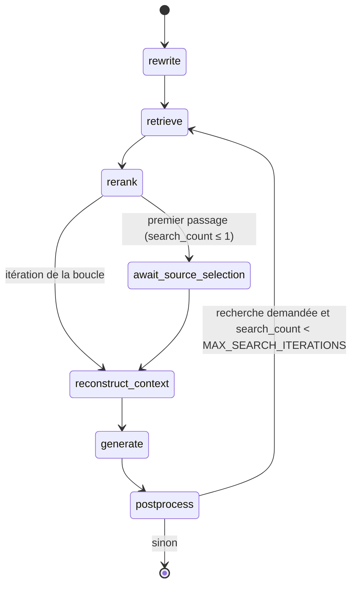
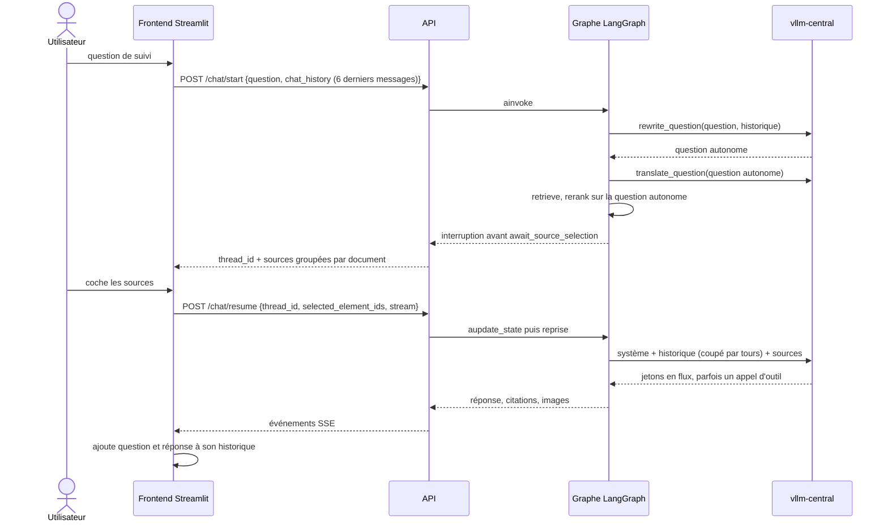

# L'agent en détail

Les nœuds du graphe LangGraph, l'état qu'ils se passent, la mémoire de conversation, les prompts, la boucle agentique et la table des réglages. Pour qui modifie le comportement de l'agent.

La vue système (services, écritures, décisions) est dans [architecture.md](architecture.md) ; le chemin d'une question, en schéma, dans le [README](../README.md#le-chemin-dune-question).

## Le graphe

Vérifié contre `build_graph`, `src/agent/graph.py` :



| Nœud | Ce qu'il fait |
|---|---|
| `rewrite` | Rend une question de suivi autonome (`rewrite_question`, sans appel au modèle s'il n'y a pas d'historique ou si `QUERY_REWRITE=false`), puis la traduit dans l'autre langue du corpus (`translate_question`, si `CROSS_LINGUAL_SEARCH=true`) |
| `retrieve` | Recherche dense et BM25 pour la question et sa traduction, fusion RRF, coupe à `RETRIEVAL_TOP_K` ; incrémente `search_count` |
| `rerank` | Cross-encoder, déduplication par `element_id`, coupe à `RERANK_TOP_K` |
| `await_source_selection` | Point d'interruption du flux interactif ; sans effet dans `answer_graph` |
| `reconstruct_context` | Sélection (humaine, ou les `AUTO_SELECT_TOP_K` premières), puis reconstruction de chaque section par le graphe, par pertinence décroissante |
| `generate` | Budget de fenêtre, prompt, génération en flux avec l'outil `search_vectors` |
| `postprocess` | Résolution des `[src:ID]` et `[img:ID]`, restreinte aux éléments réellement soumis ; décide d'une recherche supplémentaire |

Deux compilations du même graphe, `agent_graph` (interruption avant `await_source_selection`, checkpointer SQLite) et `answer_graph` (ni l'un ni l'autre) : voir [architecture.md](architecture.md#deux-entrées-dans-le-même-graphe).

Protocole du flux interactif :

1. `POST /chat/start` : `ainvoke` s'arrête avant `await_source_selection` et rend `thread_id` et les sources groupées par document.
2. `POST /chat/resume` : `aupdate_state(config, {selected_element_ids})`, puis reprise au point d'interruption, en SSE. Chaque nouvelle génération de la boucle agentique commence par un événement `reset`.

## La mémoire de conversation

Le serveur ne garde pas la conversation pour le client. Le frontend tient l'historique et l'envoie à chaque `/chat/start`, dans `chat_history` ; il y ajoute la question et la réponse une fois celle-ci reçue.



| | |
|---|---|
| Chez le client | Le frontend garde l'historique ; sans historique reçu, l'agent repart de zéro |
| Deux usages | La réécriture de la question, puis le prompt de génération |
| Bornes | `MAX_HISTORY_PAYLOAD` (50) messages acceptés par requête, `MAX_HISTORY_MESSAGES` (6) retenus ; la coupe au budget porte sur des tours entiers (`fit_history`) ; un message `system` venu du client est refusé |
| `checkpoints.sqlite` | Ce n'est pas cette mémoire : il garde une session suspendue entre `/chat/start` et `/chat/resume` |
| `usage.sqlite` | Journal de mesure, jamais relu pour répondre |
| Dans une seule question | La boucle agentique : le modèle réclame une recherche de plus, plafonnée par `MAX_SEARCH_ITERATIONS` |

## Les modules

| Module | Responsabilité |
|---|---|
| `src/agent/graph.py` | Nœuds, arêtes, compilation, résolution des citations |
| `src/agent/state.py` | `AgentState`, l'état passé de nœud en nœud |
| `src/agent/retriever.py` | Recherche dense et lexicale, reranking, déduplication, texte intégral, garde du modèle d'embedding |
| `src/agent/lexical.py` | Index BM25 et fusion RRF |
| `src/agent/graph_context.py` | Reconstruction par NebulaGraph : fil des titres, fenêtre, sections voisines, légendes |
| `src/agent/llm.py` | Réécriture, traduction, budget de fenêtre, génération, outil `search_vectors` |
| `src/agent/dialecte_llm.py` | Forme unique des requêtes au serveur d'inférence |
| `src/agent/flux_llm.py` | Lecture du flux de génération et des appels d'outil fragmentés |
| `src/agent/repli_outil.py` | Repérage d'un appel d'outil écrit dans la prose |
| `src/agent/stockage_objet.py` | Lecture des objets médias, seul site qui importe la bibliothèque cliente S3 |
| `src/agent/sessions.py` | Registre durable des sessions et purge |
| `src/agent/usage.py` | Capture d'usage |
| `src/agent/chronometrie.py` | Partition du temps par étage |
| `src/agent/settings.py` | Configuration `pydantic-settings`, seule source de vérité des défauts |
| `src/api/main.py` | Les onze routes, CORS, clé d'API, `/health`, branchement de la capture |
| `src/api/schemas.py` | Modèles Pydantic des requêtes et réponses, bornes d'entrée |
| `src/api/identite_du_code.py` | Le sha du code gravé dans l'image |
| `src/frontend/app.py` | Interface en trois phases : question, sélection des sources, réponse |

## L'état de l'agent

Extrait de `src/agent/state.py`, qui fait foi :

```python
class AgentState(TypedDict):
    question: str
    chat_history: list[Message]
    search_query: str | None            # question rendue autonome
    search_translation: str | None      # la même dans l'autre langue du corpus
    retrieved_chunks: list[ChunkResult]
    reranked_chunks: list[ChunkResult]
    selected_element_ids: list[str]     # sélection humaine, vide pour /answer
    max_sources: int | None             # None = AUTO_SELECT_TOP_K
    top_k: int | None                   # None = RETRIEVAL_TOP_K
    enriched_contexts: list[SectionContext]   # sections candidates
    submitted_contexts: list[SectionContext]  # celles que le budget a retenues
    response: str
    citations: list[Citation]
    images: list[ImageRef]
    search_count: int
    needs_more_info: bool
    next_query: str | None
    dropped_contexts: int               # écartées par le budget de fenêtre
    generation_measure: PromptMeasure | None  # décomptes réels du serveur
    _metadata: dict                     # chronométrage par étage
```

`enriched_contexts` et `submitted_contexts` existent pour la mesure : une précision du contexte calculée sur les candidates mesurerait une intention, pas ce qui a été payé en tokens.

## La stratégie RAG

1. **Réécriture** de la question de suivi, dans sa langue d'origine.
2. **Recherche hybride et translingue** : jusqu'à quatre classements (dense et BM25, pour la question et sa traduction), `FETCH_K` candidats chacun, fondus par RRF pondéré (`RRF_K`, `TRANSLATION_WEIGHT`).
3. **Reranking** par `cross-encoder/mmarco-mMiniLMv2-L12-H384-v1`, multilingue. Le score montré à l'utilisateur est la sigmoïde du logit. Aucun seuil de pertinence : une question hors corpus reçoit `RERANK_TOP_K` sources comme les autres.
4. **Sélection** : l'utilisateur coche, parmi des sources groupées par document ; sans lui, les `AUTO_SELECT_TOP_K` premières.
5. **Reconstruction** : fil des titres jusqu'au `Document`, fenêtre de `CONTEXT_WINDOW_BEFORE` + `CONTEXT_WINDOW_AFTER` + 1 éléments autour de l'ancre, découpée par position ([stores.md](stores.md#les-trois-réserves-de-lecture-de-sequence)), `ADJACENT_SECTION_ELEMENTS` éléments des sections voisines, légendes des illustrations, texte intégral relu dans l'index.
6. **Génération citée** : chaque élément du prompt porte son marqueur `[src:ELEMENT_ID]`, et le modèle ne peut citer que de vrais identifiants.
7. **Post-traitement** : `[src:…]` résolus vers ouvrage, document, page et section, y compris dans un crochet à plusieurs identifiants ; un identifiant inventé est ignoré. Les illustrations affichées sont celles des sections d'où viennent les citations, au plus `MAX_IMAGES`.

Le modèle d'embedding est `paraphrase-multilingual-MiniLM-L12-v2` (384 dimensions), identique à celui de l'ingestion et vérifié à chaque recherche ([stores.md](stores.md#le-modèle-dembedding-doit-être-le-même-des-deux-côtés)). Cette documentation a longtemps annoncé `all-MiniLM-L6-v2`, un modèle anglais : c'était faux depuis la réingestion multilingue (§4.4 du [registre](axes_amelioration.md)).

## Les prompts

Versionnés dans `prompts/`, montés en lecture seule dans le conteneur (`PROMPTS_DIR`) ; hors conteneur, repli sur le dossier du dépôt. Leur condensat entre dans l'empreinte de configuration de la capture d'usage.

| Fichier | Rôle |
|---|---|
| `system.txt` | Règles : citer chaque affirmation, ne rien inventer, admettre l'ignorance, appeler l'outil plutôt que répondre partiellement |
| `answer_with_context.j2` | Injecte les sections reconstruites et la question |
| `rewrite_query.j2` | Rend une question de suivi autonome |
| `translate_query.j2` | Traduit la question entre français et anglais |

## La boucle agentique

`search_vectors(query)` est déclaré comme outil natif (`NATIVE_TOOL_CALLING=true`) : le modèle répond par un `tool_calls` structuré, capté dans le flux et jamais montré à l'utilisateur. Si le modèle en demande plusieurs, seul le premier est servi. La sous-question repart dans `retrieve`, sans traduction ni réécriture, et le rerank passe directement à la reconstruction ; les nouvelles sources s'ajoutent aux précédentes. La boucle s'arrête sans appel d'outil, ou à `MAX_SEARCH_ITERATIONS` (3).

Le repli pour un modèle qui écrit l'appel dans sa prose a un seul site, `lire_et_retirer` de `src/agent/repli_outil.py`, qui rend d'un même passage la sous-question et le texte nettoyé. Formes reconnues, mesurées le 15 septembre 2026 sur ce que les modèles écrivent réellement :

| Forme |
|---|
| `search_vectors("…")` |
| `search_vectors(query="…")` |
| `search_vectors(sous_question="…")` |
| `search_vectors(sous-question="…")` |

Le nom d'argument n'est pas comparé à une liste : c'est la forme qui est exigée (un identifiant, `=`, une chaîne entre guillemets). Exiger la parenthèse et les guillemets évite d'attraper une phrase qui nomme l'outil sans l'appeler. Le nettoyage du texte ne dépend pas du canal : un appel natif doublé dans la prose est retiré aussi.

## Le budget de contexte

`LLM_NUM_CTX` borne ce que le client envoie ; la fenêtre du serveur est fixée à son lancement et publiée par `/health` (`moteur_llm.fenetre_servie`). Le budget de sources vaut la fenêtre, moins la génération, moins tout ce que le prompt contient déjà. Formule, mesures et ordre des coupes : [llm.md](llm.md#le-budget-de-contexte).

## Les réglages

Défauts lus dans `src/agent/settings.py`, qui fait foi ; `.env.example` porte la liste complète des variables.

| Variable | Défaut | Rôle |
|---|---|---|
| `LLM_HOST` | `http://vllm-central:8000` | Serveur d'inférence |
| `LLM_MODEL` | `google/gemma-4-E4B-it-qat-w4a16-ct` | Modèle de génération |
| `LLM_TEMPERATURE` | `0.1` | Température |
| `LLM_MAX_TOKENS` | `4096` | Plafond de génération |
| `LLM_NUM_CTX` | `8192` | Budget de prompt du client |
| `LLM_THINKING` | `false` | Raisonnement, désactivé par requête |
| `HISTORY_WINDOW_SHARE` | `0.25` | Part de la fenêtre laissée à l'historique |
| `TRUNCATION_FLOOR_SHARE` | `1/3` | Part minimale d'une source tronquée |
| `TORCH_DEVICE` | `cuda` | Périphérique de l'embedder et du reranker ([gpu_cuda.md](gpu_cuda.md)) |
| `TORCH_MAX_CONCURRENCY` | `4` | Requêtes admises en même temps dans un étage torch |
| `EMBEDDING_MODEL_NAME` | `paraphrase-multilingual-MiniLM-L12-v2` | Modèle d'embedding, identique à l'ingestion |
| `RERANK_MODEL` | `cross-encoder/mmarco-mMiniLMv2-L12-H384-v1` | Cross-encoder |
| `HYBRID_SEARCH` | `true` | BM25 en plus du dense |
| `FETCH_K` | `50` | Candidats par moteur et par requête |
| `RRF_K` | `60` | Amortissement de la fusion RRF |
| `RETRIEVAL_TOP_K` | `50` | Candidats gardés après fusion |
| `CROSS_LINGUAL_SEARCH` | `true` | Cherche aussi avec la traduction |
| `TRANSLATION_WEIGHT` | `1.0` | Poids de la traduction dans la fusion |
| `RERANK_TOP_K` | `10` | Éléments distincts gardés après reranking ; borne de `max_sources` |
| `AUTO_SELECT_TOP_K` | `3` | Sources reconstruites sans sélection humaine |
| `QUERY_REWRITE` | `true` | Réécriture des questions de suivi |
| `NATIVE_TOOL_CALLING` | `true` | Outil natif plutôt que repli dans la prose |
| `MAX_SEARCH_ITERATIONS` | `3` | Plafond de la boucle agentique |
| `CONTEXT_WINDOW_BEFORE`, `CONTEXT_WINDOW_AFTER` | `6`, `6` | Éléments retenus autour de l'ancre |
| `ADJACENT_SECTION_ELEMENTS` | `3` | Éléments repris des sections voisines (0 désactive) |
| `NEIGHBOUR_SECTION_UNCLES` | `false` | Chercher les sections voisines un niveau plus haut |
| `MAX_IMAGES` | `4` | Illustrations affichées au plus |
| `FULL_TEXT_FROM_VECTORS` | `true` | Texte intégral relu dans l'index |
| `GRAPH_TEXT_TRUNCATION` | `2000` | Doit suivre le `graph_text_max_chars` de l'ingestion |
| `NEBULA_TIMEOUT_MS` | `15000` | Délai d'une requête au graphe |
| `RESTRICT_MEDIA_TO_GRAPH` | `true` | Le proxy ne sert que les objets cités par le graphe |
| `CHECKPOINT_DB_PATH` | `/app/data/checkpoints.sqlite` | Sessions et registre de leur purge ; vide = en mémoire |
| `SESSION_TTL_SECONDS` | `3600` | Âge au-delà duquel une session est purgée |
| `MAX_LIVE_SESSIONS` | `200` | Sessions gardées au plus |
| `USAGE_CAPTURE` | `true` | Capture d'usage ([capture_usage.md](capture_usage.md)) |
| `USAGE_DB_PATH` | `/app/data/usage.sqlite` | Même volume que les sessions |
| `API_KEY` | vide | Vide = aucune authentification ([SECURITY.md](SECURITY.md)) |
| `CORS_ORIGINS` | `http://localhost:8506,http://localhost:8501` | Origines autorisées |
| `LOG_LEVEL` | `INFO` | Un `logger.debug` est invisible à ce niveau |

Adresses des stores et clés du stockage objet : [stores.md](stores.md). Le `.env` d'un poste surcharge ces défauts ; `/health` publie ce qui est en vigueur pour le moteur et le périphérique.

## Les limites connues

| Aspect | Limite |
|---|---|
| Pertinence | Aucun seuil : une question hors corpus reçoit des sources comme les autres |
| Latence | La génération porte l'essentiel du temps d'une réponse ([README](../README.md#retours-de-fonctionnement)) |
| Index BM25 | La première recherche après un démarrage le construit et paie ce coût |
| Traduction | Un appel au modèle de plus par question |
| Multi-workers | Index BM25 et modèles chargés par processus ; `POST /reindex` ne reconstruit que le worker qui le reçoit. Le déploiement tourne un worker |
| Authentification | Le frontend n'envoie pas de clé : `API_KEY` posée coupe l'interface ([SECURITY.md](SECURITY.md)) |
| Streaming | SSE implémenté, sans test de bout en bout depuis un navigateur |
| Observabilité | Journaux console et `/health` ; pas de traçage distribué |
