# Manuel utilisateur

Ce manuel montre l'agent au travail, sur des questions réellement posées à la
version servie. Chaque étape a sa capture d'écran, puis deux parties :

- **Ce que voit l'utilisateur** : l'écran, et le geste à faire.
- **Ce qui s'est passé derrière** : ce que le système a fait pour CETTE requête,
  avec ses chiffres.

Le fonctionnement interne est détaillé dans [architecture.md](architecture.md)
et [agent_architecture.md](agent_architecture.md). Ce manuel n'en donne que ce
qu'il faut pour lire une réponse.

## 1. Avant de commencer

### Ce que fait l'agent

L'agent répond à des questions sur un corpus de livres techniques, en citant ses
sources. Le corpus servi compte trois ouvrages, tous en anglais :

- *MLOps with Databricks* ;
- *Practical MLflow for Generative AI on Databricks* ;
- *Hands-On RAG for Production* (un PDF).

La question peut être posée en français : l'agent cherche dans les deux langues
et répond en français.

### Où le trouver

| | Adresse |
|---|---|
| L'interface | <http://localhost:8506> |
| L'API | <http://localhost:8011> (documentation interactive sur `/docs`) |

### Ce que l'application enregistre

**Chaque question posée dans l'interface est enregistrée.** C'est le
fonctionnement normal du service, activé par défaut : la question telle qu'elle
a été écrite, sa traduction, les sources proposées, celles qui ont été
décochées, la réponse, et le clic Utile ou Inutile avec son commentaire.
L'enregistrement reste sur le disque du serveur, sans purge, et ne part sur aucun
réseau. Le détail est dans [capture_usage.md](capture_usage.md).

Les questions de ce manuel ont donc été enregistrées elles aussi, y compris le
clic Utile de l'étape 6.

### D'où viennent les chiffres

Toutes les requêtes de ce manuel ont été posées le **27 septembre 2026 entre
06:20:58 et 06:21:59 UTC**, par un navigateur sans tête, sur la version servie :
code `a1f3036` (v1.1.0), modèle `google/gemma-4-E4B-it-qat-w4a16-ct` servi par
vLLM. Chaque chiffre vient de l'une de ces trois sources, et d'aucune autre :

| Source | Ce qu'elle donne |
|---|---|
| Le journal du conteneur `rag-agent-api` | la traduction, la réécriture, les décomptes de la recherche, du reranking et de la reconstruction, la taille du prompt |
| La capture d'usage, lue par l'identifiant de la conversation | la question traduite complète, le classement avec les pertinences, les sources retenues et écartées, le compteur de recherches, les durées de recherche, de reranking et de génération, l'appréciation |
| Le script de capture | le temps écoulé dans le navigateur, entre le clic et l'affichage |

**Deux durées ne sont pas publiées sur ce chemin**, et le manuel ne les estime
pas : la durée de la traduction, et le détail entre recherche dense, recherche
lexicale et fusion. La route `/answer` de l'API les publie (champ `timings`) ;
l'interface passe par `/chat/start` et `/chat/resume`, qui ne les publient pas.
La durée de recherche publiée contient ces trois étages.

Le temps mesuré dans le navigateur est une borne haute : le script attend
0,5 seconde que l'affichage se stabilise avant de relever l'instant.

### Le parcours en trois écrans

1. **La question.** L'utilisateur l'écrit et lance la recherche.
2. **Les sources.** L'agent propose dix passages classés. L'utilisateur garde
   ceux qu'il veut.
3. **La réponse.** Elle s'écrit en direct, puis s'affiche avec ses citations et
   ses illustrations. L'utilisateur peut donner son avis.

La ligne « Connecté à … » affichée sous le titre de l'interface donne l'adresse
interne de l'API. Elle est masquée sur toutes les captures de ce manuel.

## 2. Premier cas : le coût d'un RAG en production

Une équipe hésite entre construire son propre système RAG et acheter une solution
clés en main. Elle interroge l'agent, puis pose une question de suivi.

### Étape 1 — Poser la question

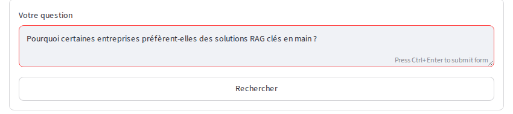

**Ce que voit l'utilisateur.** Un champ « Votre question » et un bouton.

1. Écrire la question : *Pourquoi certaines entreprises préfèrent-elles des
   solutions RAG clés en main ?*
2. Cliquer sur **Rechercher**, ou appuyer sur Ctrl+Entrée.

**Ce qui s'est passé derrière.**

- **Réécriture : aucune.** L'historique est vide, la question se suffit à
  elle-même. L'agent n'appelle pas le modèle pour cette étape.
- **Traduction.** Le corpus est en anglais. L'agent traduit la question pour
  chercher aussi avec les mots des livres :
  *Why do some companies prefer turnkey RAG solutions?* La traduction ne sert
  qu'à chercher : le modèle qui rédige la réponse voit la question d'origine.
  Voir [agent_architecture.md, Stratégie RAG](agent_architecture.md#stratégie-rag).

### Étape 2 — Lire les sources proposées

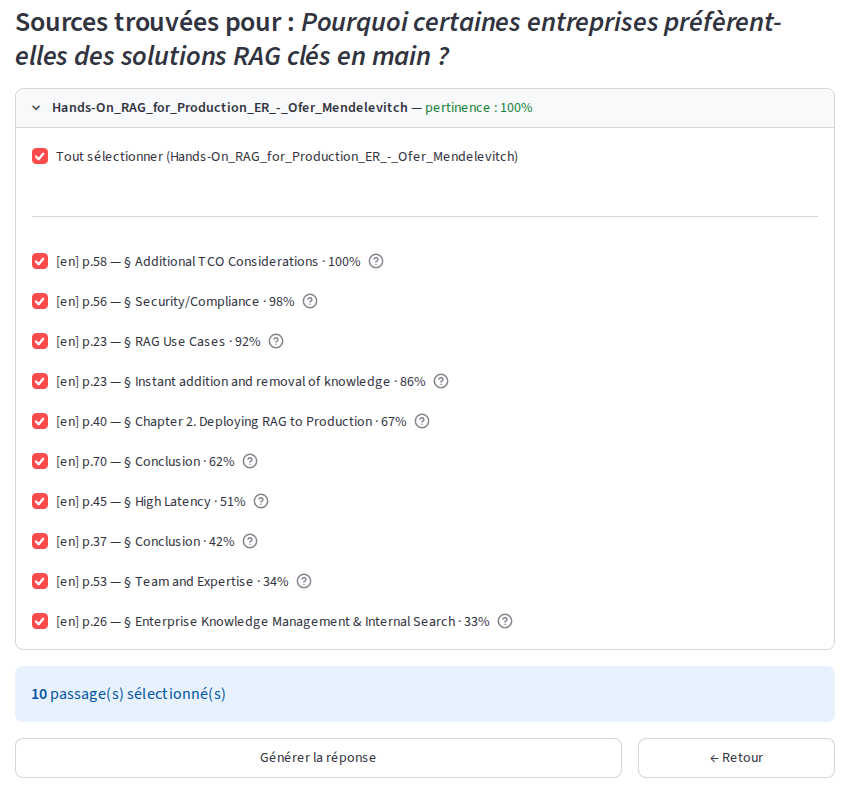

**Ce que voit l'utilisateur.** Les passages trouvés, groupés par document. Chaque
ligne donne la langue du document (`[en]`), la page, la section et une
pertinence en pourcentage. Ici, les dix passages viennent du même livre, de la
page 23 à la page 70, avec une pertinence de 100 % à 33 %. Tous sont cochés par
défaut. Survoler le point d'interrogation affiche le début du passage.

**Ce qui s'est passé derrière.**

- **Recherche dense et lexicale.** Quatre recherches sont lancées : par le sens
  (recherche dense, qui compare des vecteurs) et par les mots (recherche
  lexicale, BM25), chacune sur la question française et sur sa traduction.
  Chacune a ramené **50** candidats (journal : `50 + 50 + 50 + 50`).
- **Fusion.** Les quatre listes sont fusionnées sur les rangs (Reciprocal Rank
  Fusion) : un passage bien classé par plusieurs recherches remonte. La fusion
  garde **50** candidats.
- **Reranking.** Un second modèle relit chaque candidat face à la question et le
  note. **50** passages notés, **10** gardés. La pertinence affichée est cette
  note ramenée entre 0 et 100 % : le premier passage, p. 58, a une note brute de
  6,78, soit 99,9 %, affiché 100 %.
- **Durées publiées** : recherche **174 ms** (les quatre recherches et la
  fusion), reranking **60 ms**. Dans le navigateur, **1,4 s** entre le clic et
  l'affichage des sources.

Voir [agent_architecture.md, Stratégie RAG](agent_architecture.md#stratégie-rag),
points 2 et 3.

### Étape 3 — Choisir les sources

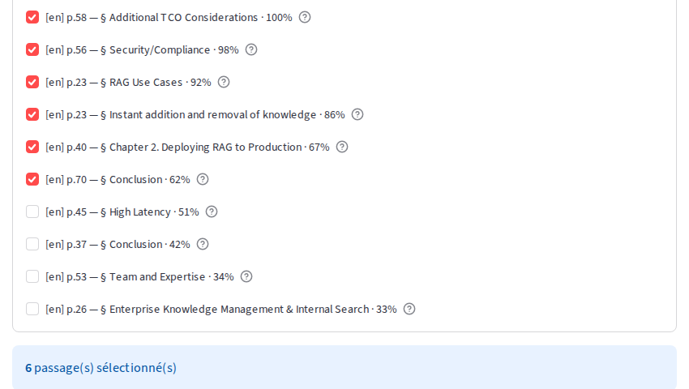

**Ce que voit l'utilisateur.** Chaque passage se coche ou se décoche. La case
« Tout sélectionner » agit sur tout le document. Le bandeau bleu compte les
passages gardés.

1. Décocher les passages trop éloignés de la question. Ici, les quatre sous 60 % :
   *High Latency* (51 %), *Conclusion* p. 37 (42 %), *Team and Expertise*
   (34 %), *Enterprise Knowledge Management & Internal Search* (33 %).
2. Vérifier le compte : **6 passage(s) sélectionné(s)**.
3. Cliquer sur **Générer la réponse**.

**Ce qui s'est passé derrière.**

- **Sources retenues : 6.** La capture d'usage enregistre les quatre passages
  décochés comme écartés par l'utilisateur. C'est une information utile pour
  améliorer le classement : un humain a jugé ces passages hors sujet.
- **Sections reconstruites par le graphe : 6.** Un passage seul est un fragment.
  Pour chaque passage gardé, l'agent interroge le graphe du document et
  reconstruit la section entière : le fil des titres jusqu'au livre, les
  éléments de la section, et quelques éléments voisins avant et après. Les six
  sections comptent de 1 à 7 éléments. Une seule a été raccourcie autour du
  passage (7 éléments gardés sur 8). Durée : **225 ms**.

Voir [agent_architecture.md, Stratégie RAG](agent_architecture.md#stratégie-rag),
points 4 et 5.

### Étape 4 — Suivre la génération en flux

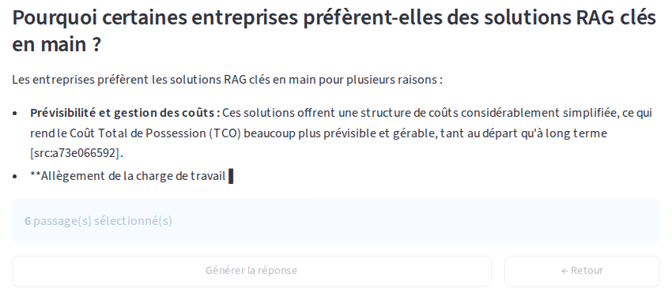

**Ce que voit l'utilisateur.** La réponse s'écrit mot à mot, avec un curseur en
fin de texte. Les boutons de l'écran précédent sont grisés. Pendant l'écriture,
les citations apparaissent sous leur forme brute, `[src:a73e066592]` ; elles
deviennent des numéros quand la réponse est terminée.

**Ce qui s'est passé derrière.**

- **Le prompt.** Le modèle reçoit les six sections, chaque élément suivi de son
  identifiant, et la consigne de citer ces identifiants. Taille réelle, comptée
  par le serveur d'inférence : **4 364 tokens**.
- **Le flux.** Le serveur envoie chaque morceau de texte dès qu'il est produit.
  Cette capture a été prise **2,2 s** après le clic, avec 353 caractères déjà
  affichés. La génération s'est terminée côté serveur 2,4 s plus tard.
- **Génération : 4 296 ms**, pour une réponse de **903 caractères**. Dans le
  navigateur, **5,6 s** entre le clic et la réponse complète.

### Étape 5 — Lire la réponse et ses citations

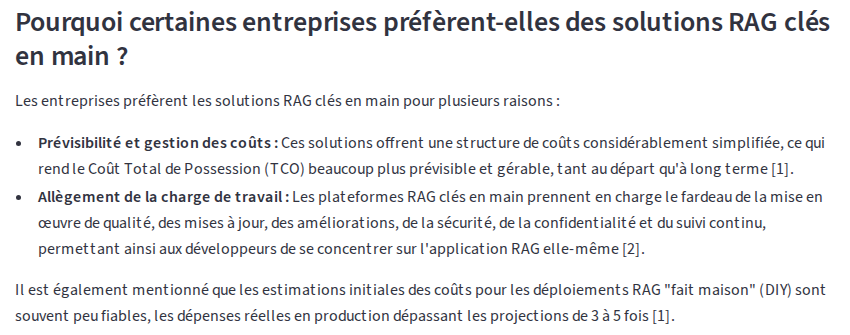

**Ce que voit l'utilisateur.** La réponse en français, structurée, où chaque
affirmation porte un renvoi numéroté : `[1]`, `[2]`.

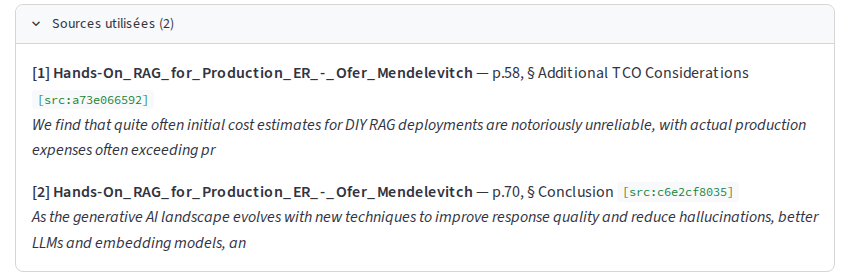

Sous la réponse, l'encadré « Sources utilisées » donne pour chaque renvoi le
document, la page, la section, l'identifiant de l'élément et le début du
passage cité :

- **[1]** *Hands-On RAG for Production*, p. 58, § *Additional TCO
  Considerations* ;
- **[2]** *Hands-On RAG for Production*, p. 70, § *Conclusion*.

Ouvrir le livre à la page indiquée pour vérifier une affirmation.

**Ce qui s'est passé derrière.**

- **Citations : 2.** Le modèle a cité deux identifiants. L'agent les a
  retrouvés dans les sections envoyées et les a traduits en document, page et
  section. Un identifiant que le modèle aurait inventé serait retiré de la
  réponse : il ne renvoie à rien.
- **Nombre de recherches : 1.** Le modèle n'a pas demandé de recherche
  supplémentaire. L'interface n'affiche le compteur que lorsqu'il dépasse 1
  (voir la section 5).
- **Sources écartées faute de place : 0.** Les six sections tenaient dans la
  fenêtre du modèle.

Voir [agent_architecture.md, Stratégie RAG](agent_architecture.md#stratégie-rag),
points 6 et 7.

### Étape 6 — Donner son avis

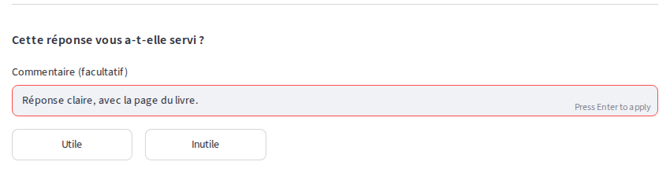

**Ce que voit l'utilisateur.** Sous la réponse : « Cette réponse vous a-t-elle
servi ? », un champ de commentaire facultatif, et deux boutons.

1. Écrire un commentaire si besoin. Ici : *Réponse claire, avec la page du
   livre.*
2. Cliquer sur **Utile** ou **Inutile**.

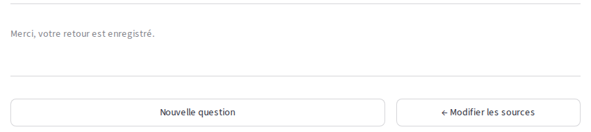

Les boutons disparaissent et laissent place à « Merci, votre retour est
enregistré. » Une réponse ne se note qu'une fois.

**Ce qui s'est passé derrière.**

- L'interface envoie l'appréciation à la route `/feedback`, avec l'identifiant de
  la conversation.
- La capture d'usage a rattaché à cette question : l'appréciation `utile`, le
  commentaire, et l'heure du clic (06:21:11 UTC). C'est la seule mesure humaine
  de la qualité d'une réponse : les décochages de l'étape 3 ne parlent que des
  sources.

Voir [capture_usage.md](capture_usage.md).

### Étape 7 — Poser une question de suivi

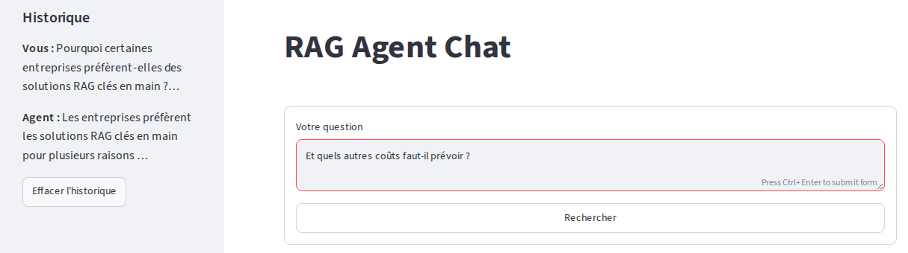

**Ce que voit l'utilisateur.** Après **Nouvelle question**, la barre latérale
« Historique » montre l'échange précédent. La question de suivi peut rester
courte, comme dans une conversation.

1. Écrire : *Et quels autres coûts faut-il prévoir ?*
2. Cliquer sur **Rechercher**.

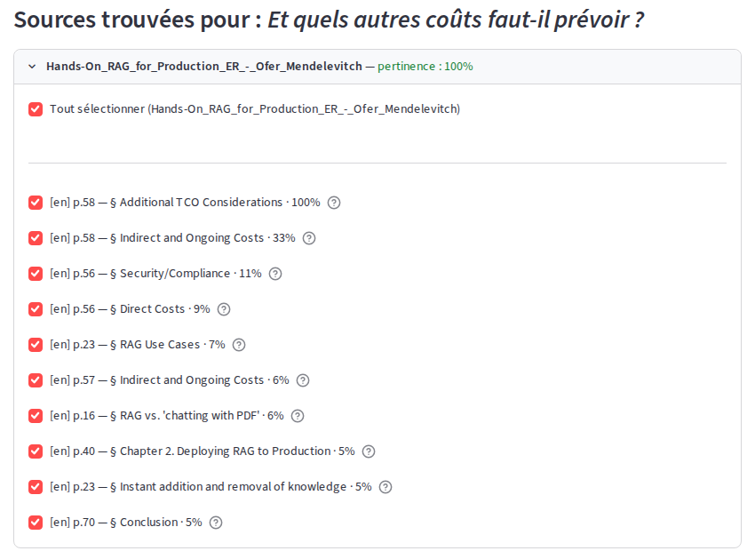

Les premières sources proposées portent sur les coûts : *Indirect and Ongoing
Costs*, *Direct Costs*, pages 56 à 58. Un seul passage dépasse 50 % de pertinence ; les
autres vont de 33 % à 5 %. Ici, tous les passages sont gardés.

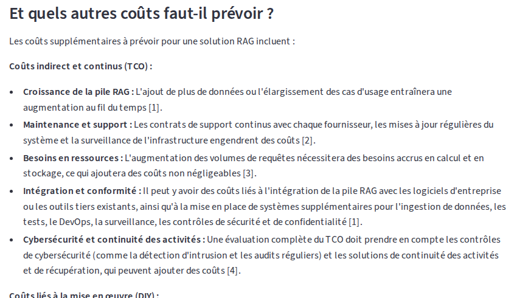

La réponse détaille les coûts indirects et continus, avec sept sources citées.

**Ce qui s'est passé derrière.**

- **La mémoire est portée par le client.** Le serveur ne garde rien d'une
  question à l'autre. C'est l'interface qui conserve l'échange et le renvoie avec
  la nouvelle question : ici, 2 messages (la question 1 et sa réponse).
  « Effacer l'historique » vide cette mémoire.
- **Réécriture.** Seule, « Et quels autres coûts faut-il prévoir ? » ne dit pas
  de quoi il s'agit. Le modèle la réécrit à l'aide de l'historique :
  *Quels autres coûts faut-il prévoir en plus des raisons pour lesquelles
  certaines entreprises préfèrent les solutions RAG clés en main ?*
- **Traduction** de la question réécrite : *What other costs should be
  anticipated in addition to the reasons why some companies prefer turnkey RAG
  solutions?*
- **Recherche** : 4 × 50 candidats, 50 après fusion, 10 après reranking.
  Recherche **188 ms**, reranking **67 ms**.
- **Sources retenues : 10. Sections reconstruites : 9.** Deux passages, p. 57 et
  p. 58, appartiennent à la même section *Indirect and Ongoing Costs* : elle
  n'est envoyée qu'une fois. Durée : **419 ms**.
- **Génération.** Prompt réel de **6 776 tokens**, génération **12 191 ms**,
  réponse de **2 226 caractères**, **7** citations. Nombre de recherches : **1**.
  Dans le navigateur, **1,9 s** jusqu'aux sources, puis **13,4 s** jusqu'à la
  réponse complète.

Voir [agent_architecture.md, Où vit la mémoire](agent_architecture.md#où-vit-la-mémoire-et-où-elle-ne-vit-pas).

## 3. Deuxième cas : une réponse illustrée

Question : *Comment MLflow Tracing aide-t-il à déboguer une application GenAI ?*

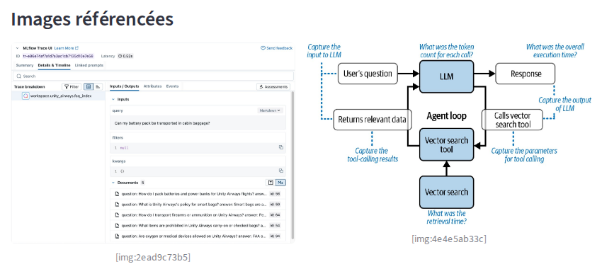

**Ce que voit l'utilisateur.** Après le texte de la réponse, une rubrique
« Images référencées » montre deux figures des livres : une capture de
l'interface de traces de MLflow, et un schéma de la boucle d'un agent. Sous
chaque image, son identifiant (`[img:2ead9c73b5]`, `[img:4e4e5ab33c]`). La
liste « Sources utilisées » suit, avec huit citations.

Les deux livres HTML n'ont pas de pagination : leurs citations affichent
**p. 1**. Seul le PDF donne une page réelle, comme au premier cas.

**Ce qui s'est passé derrière.**

- **Traduction** : *How does MLflow Tracing help debug a GenAI application?*
- **Recherche** : 4 × 50 candidats, 50 après fusion, 10 après reranking, issus
  de **5** chapitres de deux livres. Les dix passages ont une pertinence de
  99,9 % à 100 %. Recherche **167 ms**, reranking **61 ms**.
- **Sources retenues : 10**, **10** sections reconstruites en **433 ms**.
- **D'où viennent les images.** Le modèle ne voit pas les images, il ne peut pas
  juger de leur intérêt. L'agent affiche donc les illustrations **des sections
  d'où viennent les citations** : si une affirmation vient d'une section, la
  figure de cette section illustre ce dont parle la réponse. Ici, 8 citations
  ont désigné 2 illustrations, servies par la route `/media` de l'API.
- **Génération.** Prompt réel de **5 953 tokens**, génération **12 241 ms**,
  réponse de **2 388 caractères**. Nombre de recherches : **1**. Dans le
  navigateur, **1,4 s** jusqu'aux sources, puis **14,0 s** jusqu'à la réponse.

Voir [agent_architecture.md, Stratégie RAG](agent_architecture.md#stratégie-rag),
point 7.

## 4. Troisième cas : une question hors du corpus

Question : *Quelle est la recette du boeuf bourguignon ?*

### Les sources proposées

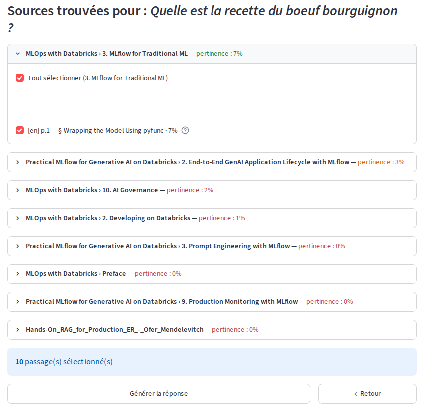

**Ce que voit l'utilisateur.** L'agent propose quand même dix passages, pris
dans huit documents. Leur pertinence va de **7 % à 0 %**.

**Lire le pourcentage, pas la couleur.** La couleur du badge est relative à la
meilleure source de la question : la première source est toujours verte, même à
7 %. Des pourcentages aussi bas disent que rien dans le corpus ne correspond.

### La réponse

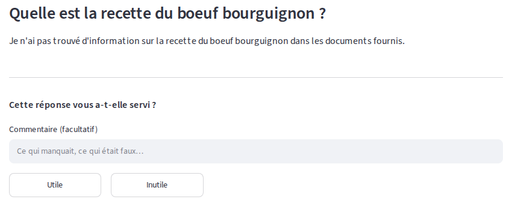

**Ce que voit l'utilisateur.** *Je n'ai pas trouvé d'information sur la recette
du boeuf bourguignon dans les documents fournis.* Aucune citation, aucune image.
L'agent n'invente pas de réponse.

**Ce qui s'est passé derrière.**

- **Traduction** : *What is the recipe for boeuf bourguignon?*
- **Recherche** : trois recherches ont ramené 50 candidats, mais la recherche
  lexicale sur la question française n'en a trouvé qu'**un** (journal :
  `50 + 50 + 1 + 50`) : les mots de la recette n'existent pas dans les livres.
  La recherche dense, elle, rend toujours les passages les moins éloignés, même
  s'ils sont loin. 50 candidats après fusion, 10 après reranking. Recherche
  **154 ms**, reranking **61 ms**.
- **Sources retenues : 10**, **10** sections reconstruites en **524 ms**.
- **Génération.** Le prompt impose de le dire quand les sources ne permettent
  pas de répondre. Prompt réel de **6 404 tokens**, génération **1 647 ms**,
  réponse de **96 caractères**, **0** citation. Nombre de recherches : **1**.
  Dans le navigateur, **1,4 s** jusqu'aux sources, puis **2,9 s** jusqu'à la
  réponse.

## 5. Ce qui n'a pas pu être montré : la recherche relancée

### Le mécanisme

Quand les sources ne suffisent pas, le modèle peut demander lui-même une
recherche supplémentaire, avec une sous-question précise. L'agent cherche alors
de nouveau, ajoute les meilleures sections trouvées (trois avec le réglage par
défaut), et le modèle réécrit sa réponse. Le nombre de recherches est plafonné
(à 3 avec le réglage par défaut).

Dans l'interface, cela se voit ainsi :

- pendant l'écriture, le texte en cours s'efface et laisse place à
  « Recherche supplémentaire… » ;
- sous la réponse, une ligne « N recherche(s) effectuée(s) » apparaît, seulement
  quand N dépasse 1.

Voir [agent_architecture.md, Boucle agentique](agent_architecture.md#boucle-agentique).

### Pourquoi il n'y a pas de capture

**Aucune question n'a déclenché de recherche supplémentaire sur la version
servie**, et ce manuel ne montre pas ce qui n'a pas eu lieu.

- **22 questions** ont été choisies pour obliger une relance, et posées par
  l'API le 27 septembre 2026, entre 06:14 et 06:18 UTC : questions à deux volets
  sans rapport entre eux, questions sur un terme absent du corpus, demandes
  explicites de « lancer une recherche supplémentaire », et deux parcours où un
  seul passage faible était coché. **Nombre de recherches : 1 pour les 22.**
- **Toutes les interactions de la préparation de ce manuel sont dans ce cas** :
  33 interactions entre 06:13 et 06:22 UTC, captures comprises, toutes à 1
  recherche. Le journal du conteneur ne porte aucune ligne « Recherche
  supplémentaire » depuis 06:12 UTC.
- **La capture d'usage dit la même chose pour le passé** : sur les **1 590**
  interactions enregistrées avant ces essais, **aucune** n'a un nombre de
  recherches supérieur à 1.
- **Ce que le modèle fait à la place** : quand une partie de la question n'est
  pas couverte, il répond sur ce qu'il a, et écrit pour le reste « Je n'ai pas
  trouvé d'information sur ce sujet dans les documents fournis. » Le prompt lui
  donne les deux consignes, admettre l'absence d'information et demander une
  recherche ; le modèle servi applique la première.

L'outil de recherche est bien transmis au modèle à chaque génération. La cause
du comportement n'a pas été instruite ici.

## 6. Récapitulatif

| Fonctionnalité | Où la voir | Chiffres de la requête |
|---|---|---|
| Question en français sur un corpus anglais | étapes 1 et 2 | traduction *Why do some companies prefer turnkey RAG solutions?*, 4 recherches de 50 candidats |
| Sources proposées, pertinence | étape 2 | 50 notés, 10 proposés, de 100 % à 33 % ; recherche 174 ms, reranking 60 ms |
| Choix des sources | étape 3 | 6 gardés, 4 décochés, 6 sections reconstruites en 225 ms |
| Génération en flux | étape 4 | 353 caractères affichés à 2,2 s ; génération 4 296 ms |
| Citations : document, section, page | étape 5 | 2 citations, p. 58 et p. 70 du PDF |
| Retour Utile / Inutile | étape 6 | `utile` et son commentaire, enregistrés à 06:21:11 UTC |
| Question de suivi, mémoire côté client | étape 7 | 2 messages d'historique, question réécrite, 9 sections pour 10 passages, 7 citations |
| Image du corpus dans la réponse | section 3 | 8 citations, 2 images servies par `/media` |
| Rien de pertinent | section 4 | pertinence de 7 % à 0 %, recherche lexicale française à 1 candidat, 0 citation |
| Recherche relancée | section 5 | **non montrée** : 1 recherche sur 22 essais ciblés, et sur 1 590 interactions antérieures |

## 7. Conseils d'usage

- **Poser une question précise.** Le classement compare la question à chaque
  passage : un terme exact du domaine (« TCO », « Unity Catalog », « tracing »)
  aide plus qu'une formulation générale.
- **Décocher franchement.** Moins de sections, c'est un prompt plus court et une
  réponse plus rapide. Une source hors sujet peut aussi détourner la réponse.
- **Vérifier une citation avant de la reprendre.** Le renvoi donne la page (PDF)
  ou la section (livres HTML) : aller lire le passage.
- **Changer de sujet : effacer l'historique.** Sinon, la question suivante est
  réécrite à la lumière de l'échange précédent.
- **« Modifier les sources »** revient à l'écran de sélection sans refaire la
  recherche.
